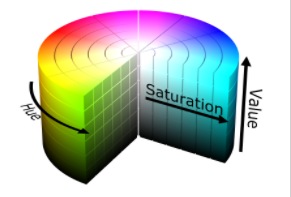
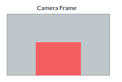
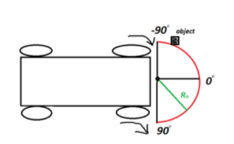
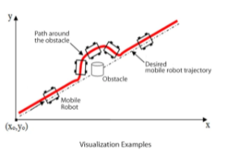

# SEEKER | UCSD ROBOCAR
MAE/ECE148 Team1 | Winter 2022


Our robocar, the Seeker, is designed to be able to search for, locate, navigate to, and collect red ping pong balls.

# Team Members
- Parker Knopf (MAE)
- Jacob Bingham (MAE)
- Moises Lopez (ECE)
- Guy Shabtai (ECE)

# Demo

Link: https://www.youtube.com/watch?v=l6U-Yuc_TLY

# About

This robot was designed to seek and pick up red ping pong balls scattered around an environment

The robocar will locate the ping pong balls with an RGBD camera. It will then drive to the ball to perform a recovery maneuver using the webcam. It will be equipped with a suction tube to pick up the ping pong balls.


## Info

### Phase 1
- Locate ping pong balls in an open and unobstructed environment
- Pick up ping pong balls
- Use Lidar for collision avoidance
- Make decisions on what ping pong balls to pick up first

### Phase 2
- All elements of Phase 1
- Locate ping pong balls with obstructions where they must be sought out by navigating around the environment
- ROS1 SLAM
- Extensive use of Lidar

# Dependencies

- This project is to be run using linux on a Jetson Nano

- Download Docker: https://hub.docker.com/r/djnighti/ucsd_robocar
``` bash
$ docker pull djnighti/ucsd_robocar
```
- Download Repository: https://github.com/gshabtai/ece148-team1.git
``` bash
$ # Start Docker
$ # Attach to Docker
$ source_ros2 
$ cd src
$ git clone https://github.com/gshabtai/ece148-team1.git
$ cd ..
```
# Set-up

1. Configure the Robot using the schematic
2. Boot up the Jetson Nano and connect through SSH
3. Start the docker
``` bash
$ # Start Docker
```
4. Source Ros with docker integrated command
``` bash
$ # source_ros2
```
5. Run the program
``` bash
$ ./src/ece148-team1/seeker.sh
```

## Hardware


Image of the assembled hardware


Image of the CAD produced in solidworks

## Schematic


## State Machine


- Nodes subscribe to topic ‘/state’.
- Nodes only allow to control navigation if on their respective state.
- This model is great for encapsulating robot behavior based on external factors

### Simple States

### Idle
- Descrition: Stops all actuator output
- Activated: When ball basked is full
- Importance: System starts on idle to calibrate the ESC value 0 as topic publish 0

### Search
- Description: Turn left on an loop until there is a ball seem by either the RGBD camera or the webcam.
- Activated: "Default" state when no ball is seem or no collition ahead has been detected.

### Backwards
- Description: Reverses the car backwards for a period of two seconds
- Activated: The state is call when a ball is lost in the align state or capture state, and during collision avoidance.

### Align
- Uses the Intel camera for wider range of view
- Subscribes to depth and rgb of intel camera
- Uses PID controller to align abll to the right of robot for capture. IOW, it gives us a centroid offset so that the ball will be directed towards the intake system rather than the front of the car.

### Capture
- Uses webcam to align ball with intake system.
- Uses PID controller to align ball to the center of the funner for ping pong ball collection.

## Dynamic Centering Control PID Controller
- Designed and provided by Dominic (Our Lord and Savior)

## CV Centroid Topic Nodes
- Used by align and capture

## Computer Vision Ball Detection

How we found the centroid, an overview.

- Computer get image from webcam and converts it HSV color space.
- Filter with HSV range, removes noise, and picks biggest blob on the resulting image.
- A moment search is done on the image to find the centroid of the blob. Which is then remap from -50-to-50 horizontally that is used for steering.



## Intake System

- Intake system subscribes to centroid topic.
- If a ball is detected within the lower region of the camera frame. The fans will turn on.
- The system then will update the number of balls that have been loaded onto the system.
- 


## Collision Avoidance State | Using LIDAR
- Car uses LIDAR to detect and avoid objects.
- Half-circle LIDAR shape to detect stationary objects
- A maximum distance (Ro) is set by the user. The car will ignore all objects outside of this radius, and then turn to avoid any object closer than this radius.
- Inner radius exists to avoid interference by car parts within range of the LIDAR.
- 


## Collision Avoidance State | Using SLAM
  
- Another method for navigating an environment with obstacles
- STEP 1 Use LIDAR to create a map of the environment.
- STEP 2 Use a navigation stack to issue goal commands (x1,y1) -> (x2,y2)
- Navigation stack would be similar to the TurtleBot from the Navigation Workshop
- Twist command for angular-z velocity (i.e. theta) would be limited to robocar’s physical constraints. This is “good enough”.
- Alternative: develop a navigation stack for Ackermann steering. Control theory stuff.

